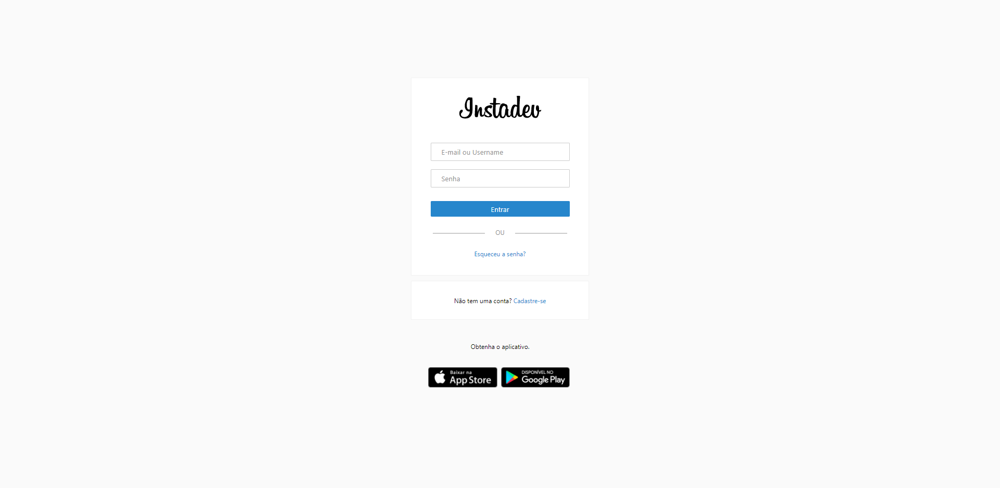
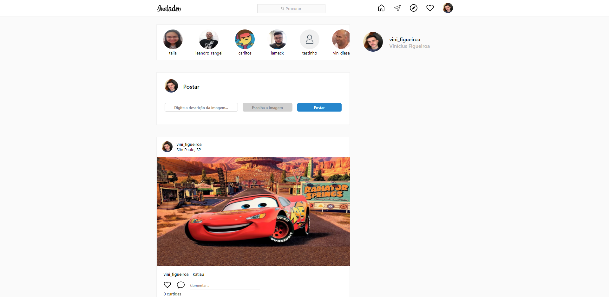
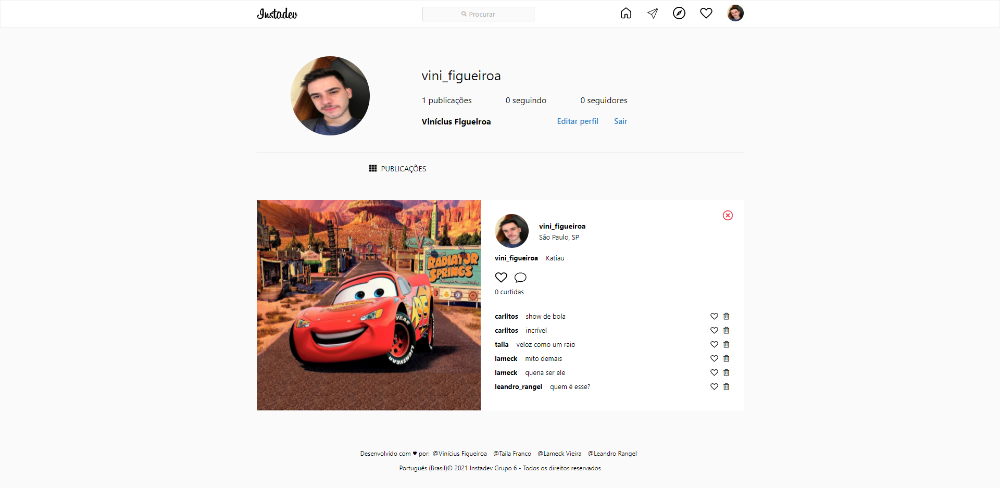
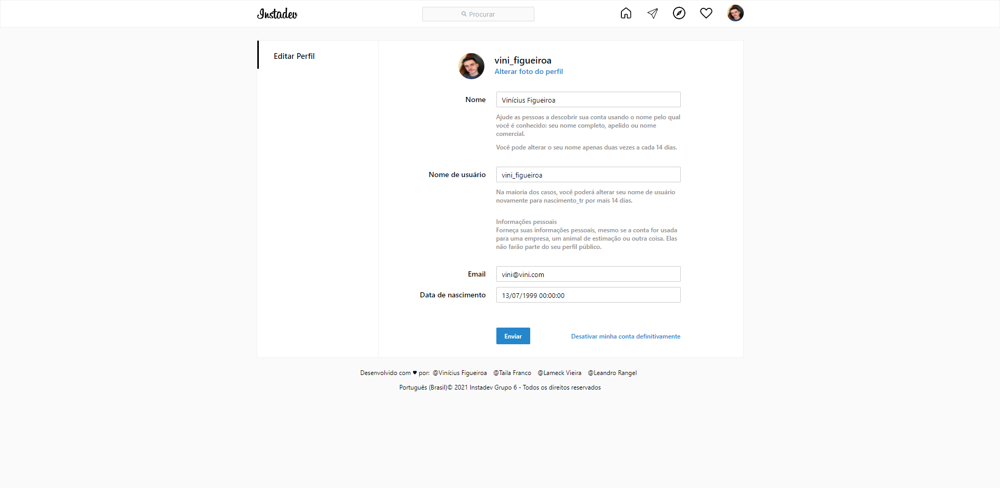
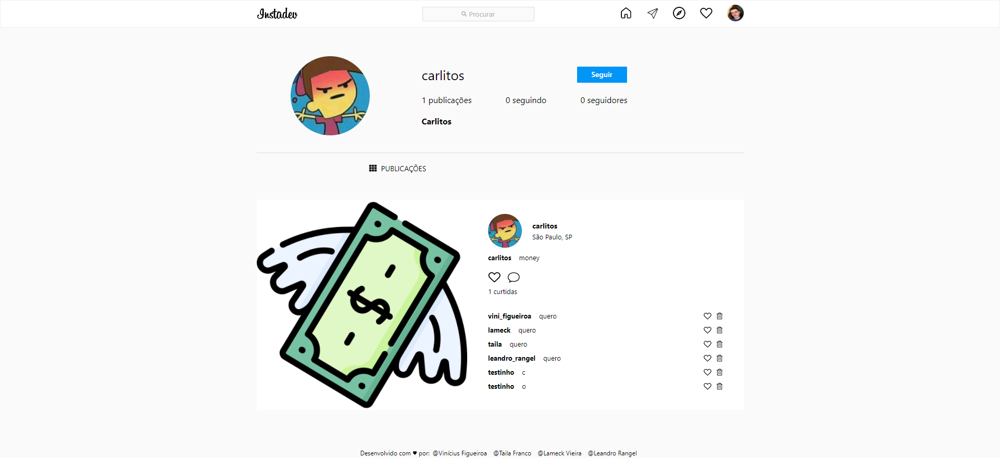

<h1 align="center">
  
</h1>
 
 

  

 

## Sobre o projeto 💬
O **Instadev** é uma aplicação web clone do Instagram, densenvolvida no 1º semestre do curso de Desenvolvimento de Sistemas do SENAI Informática. Para desenvolver esta aplicação utilizamos as metodologias ágeis Scrum e Kanban durante todo o desenvolvimento, facilitando a organização, designação de tarefas e definição de prazos de entrega. 

Além de mim, os desenvolvedores que participaram em todas as partes do projeto, desde o planejamento até as últimas atualizações, foram: *[Taila Franco](https://github.com/vinixiii)*, *[Lameck Vieira](https://github.com/vinixiii)*, e *[Leandro Rangel](https://github.com/vinixiii)*

## Funcionalidades 📌
Nossa aplicação contém todas as funcionalidades mínimas solicitadas, e algumas funcionalidades extras:

<h3 align="center">Cadastro</h3>

  

- Link para a página de Login
- Form (Email, Nome, Data de Nascimento, Username, Senha)

<h3 align="center">Login</h3>

  

- Salvar informações do usuário na sessão
- Form com email e senha
- Link para página de cadastro

<h3 align="center">Feed</h3>

  

- Link para o perfil do usuário logado
- Postar
- Exibir posts e todos os usuários cadastrados
- Curtir posts
- Comentar nos posts
- Excluir comentários
- Buscar por usuários e posts na barra de pesquisa

<h3 align="center">Perfil</h3>

  

- Link para editar perfil
- Sair da aplicação
- Exibir posts do usuário
- Contar posts publicados
- Curtir posts
- Excluir comentários

<h3 align="center">Editar perfil</h3>

  

- Excluir conta do usuário
- Possibilidade de alterar individualmente: foto; nome; username; email; data de nascimento.

<h3 align="center">Perfil de outro usuário</h3>

  

- Exibir informações do outro usuário
- Exibir posts do outro usuário
- Contar posts do outro usuário

## Tecnologias 🛠
Desenvolvido utilizando as seguintes tecnologias:
- [HTML5](https://developer.mozilla.org/pt-BR/docs/Web/HTML)
- [CSS3](https://developer.mozilla.org/pt-BR/docs/Web/CSS)
- [JavaScript](https://developer.mozilla.org/pt-BR/docs/Web/JavaScript)
- [C#](https://docs.microsoft.com/pt-br/dotnet/csharp/)
- [ASP.NET Core](https://docs.microsoft.com/pt-br/aspnet/core/?view=aspnetcore-5.0)

---

Feito com ❤ por: Vinícius Figueiroa 🙋🏻‍♂️

